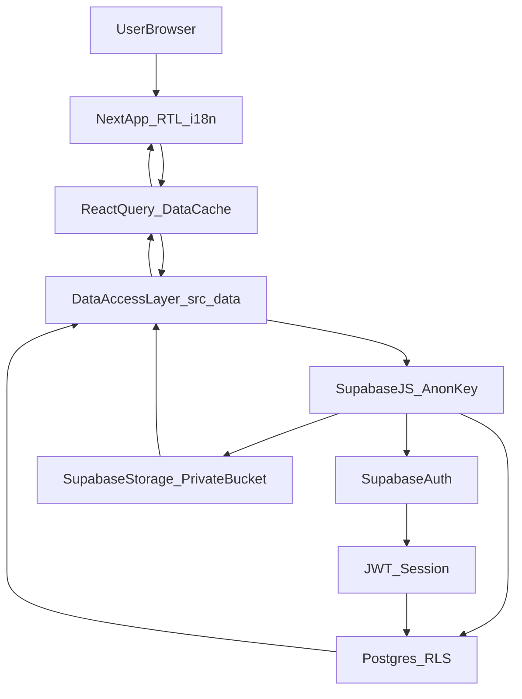

# Architecture (Arabic-first Employee Manager → HR/ERP)

This system starts as an **Employee Information & Document Management System** and is intentionally designed to evolve into a modular **HR/ERP** platform (attendance, leave, payroll, notifications) and to become **SaaS-ready** with strict multi-tenant isolation.

## Goals
- **Arabic-first UX**: RTL-first layouts, Arabic typography, locale-aware formatting, and seamless Arabic/English toggle.
- **Modular frontend**: feature-based modules with a single data access layer (no scattered queries).
- **Secure by default**: Supabase **RLS** is the primary authorization mechanism for data and documents.
- **SaaS-ready**: all core rows carry `company_id`; tenant isolation is enforced in RLS, not in application code.
- **Future-proof schema**: normalized tables and stable identifiers (UUID), with room for HR modules.

## High-level components
- **Next.js (App Router)**: UI, server rendering, routing, i18n, and client-side data fetching with React Query.
- **Supabase Postgres**: normalized relational data model, constraints, indexing.
- **Supabase Auth**: identity, sessions, JWT; `auth.uid()` used inside RLS policies.
- **Supabase Storage**: private bucket(s) for employee documents; access via signed URLs and metadata-driven authorization.
- **Edge Functions (optional)**: complex business logic (bulk import, background workflows, event-driven tasks).

## Data ownership and authorization
Authorization is enforced **at the database layer** using RLS:
- **Tenant membership** is modeled explicitly using `company_memberships`.
- **Roles** are per tenant (user can be HR in one company and employee in another).
- **CRUD rules**:
  - Admin/HR: CRUD within their tenant.
  - Employee (future): read only their own employee record + own documents.

## Frontend module boundaries
Feature modules live under `src/features/*` and must not call Supabase directly.
All reads/writes go through `src/data/*`, which provides:
- Typed query/mutation functions
- Stable query key builders
- Zod schemas used by both forms and runtime validation

## Directory map (conceptual)
- `src/app/[locale]/(auth)/*`: sign-in flows
- `src/app/[locale]/(app)/*`: authenticated app shell + features
- `src/features/employees/*`: employee UI + forms
- `src/features/documents/*`: upload/preview/list UI
- `src/data/*`: Supabase client wrappers + React Query integrations
- `supabase/migrations/*`: schema, RLS, indexes, seed helpers

## Evolution path to HR/ERP
The schema is designed so each future module becomes an **isolated slice** sharing the same tenancy + identity foundations:
- **Attendance**: shifts, punches, timesheets
- **Leave**: balances, requests, approvals, policies
- **Payroll**: salary contracts, runs, payslips, deductions
- **Notifications**: event log + delivery channels

Key invariants that enable growth:
- `company_id` on every business row
- consistent audit fields (`created_at`, `updated_at`, optional `created_by`, `updated_by`)
- stable employee identity (`employees.id`) with optional linkage to `auth.users`

## Request/authorization flow (Phase 1)

## Document access model
Documents are stored in a **private** bucket. Authorization is controlled by:
- a `documents` metadata row (employee, tenant, type, version)
- RLS allowing only tenant HR/Admin (and later the employee owner) to read metadata
- signed URL generation happens only after the metadata row is accessible

## Operational considerations
- **Migrations**: manage schema/RLS/indexes as SQL in `supabase/migrations`.
- **Seeding**: seed `roles` and a demo company/admin membership for local development.
- **Observability (future)**: store audit events in `audit_log` and emit events for notifications.

